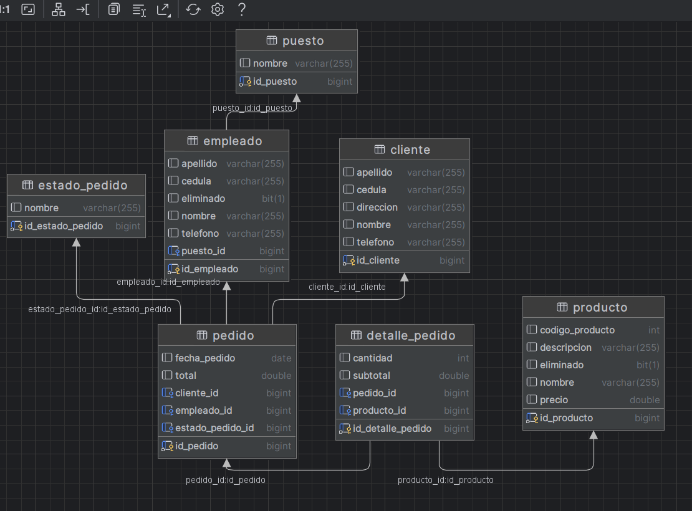
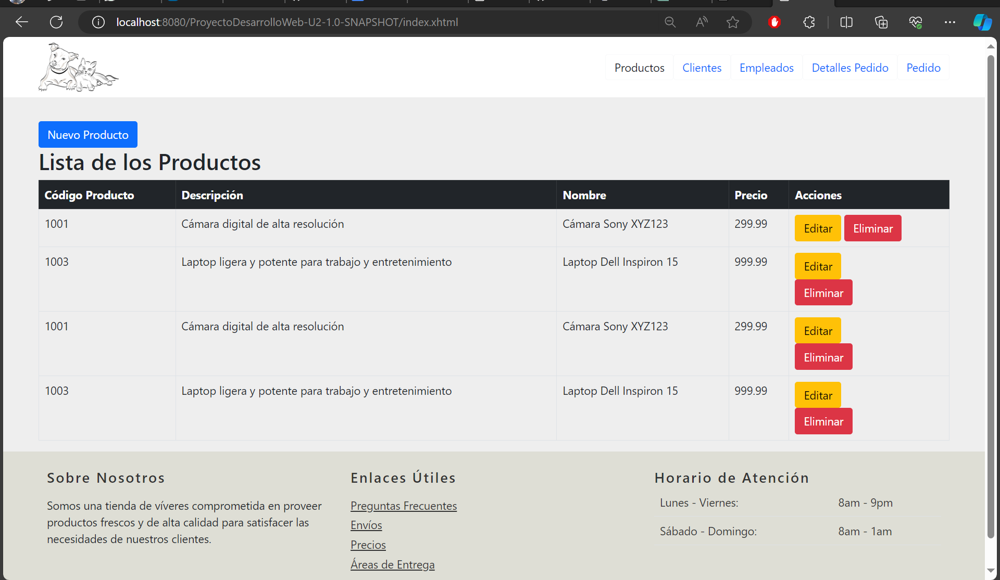
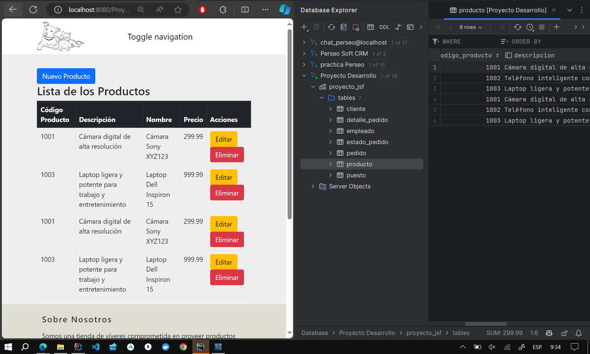
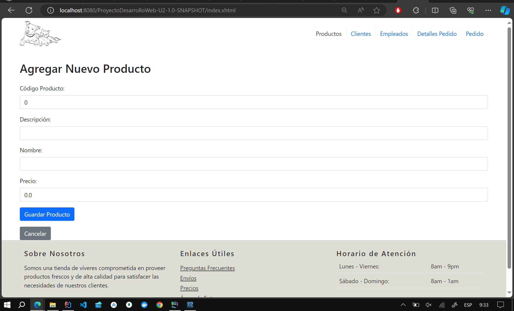
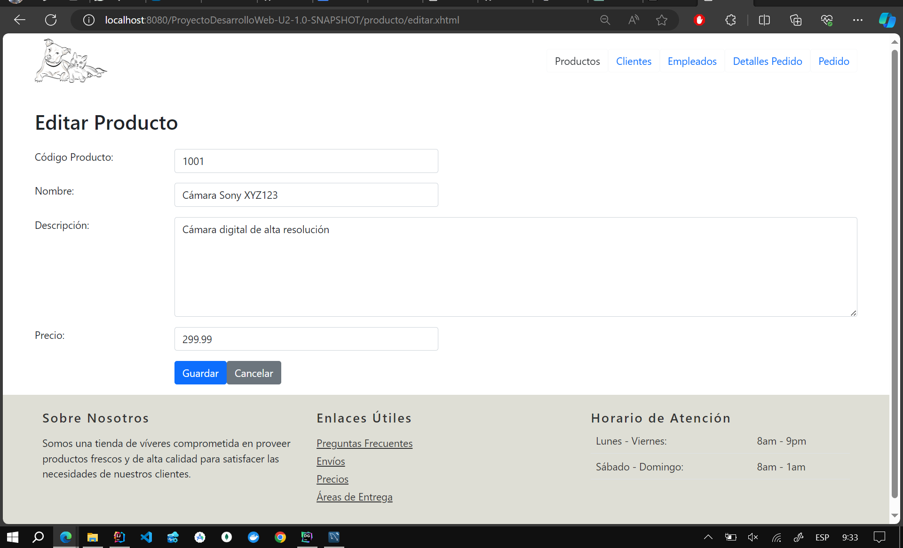
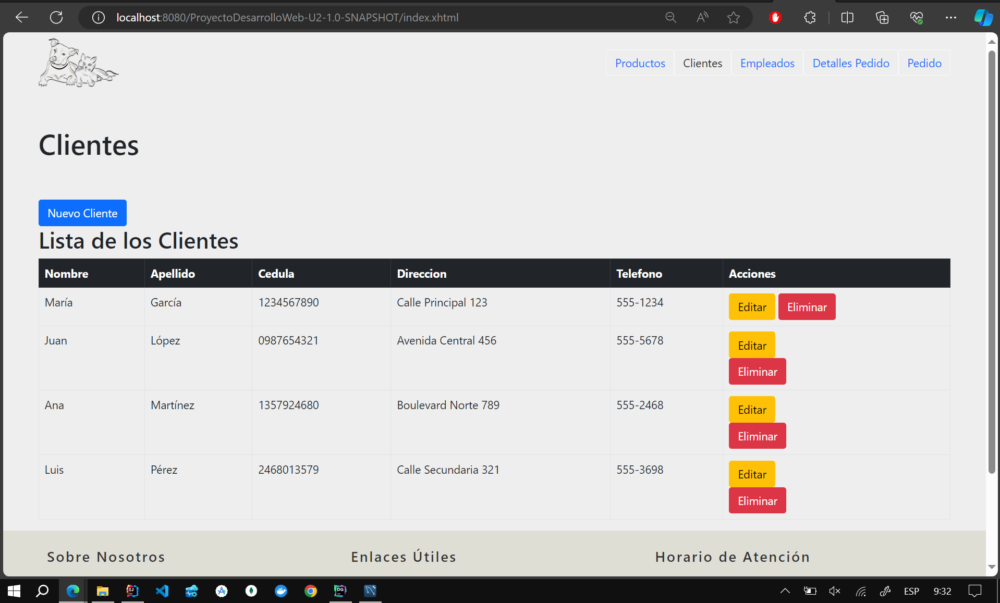
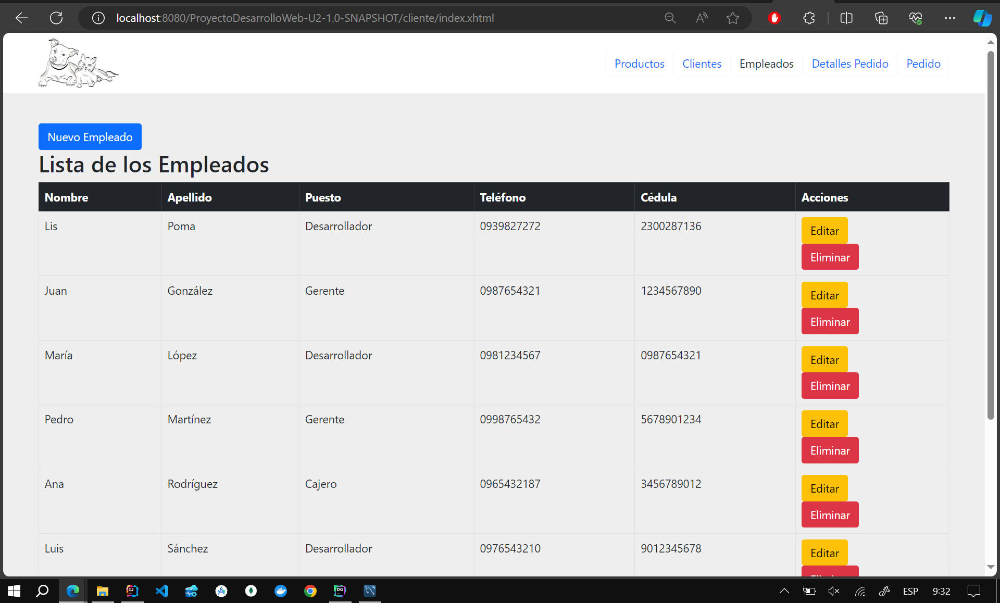
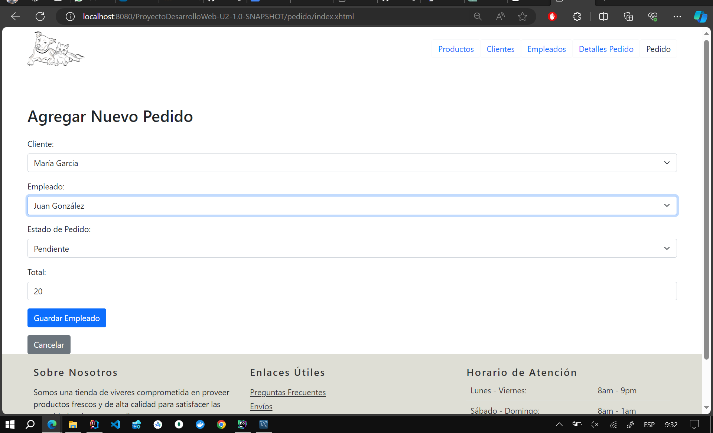

# Sistema de Venta de Productos -  CRUD con JPA y JSF

Este proyecto implementa un sistema CRUD (Crear, Leer, Actualizar, Eliminar) utilizando Java Persistence API (JPA) y JavaServer Faces (JSF) para la gestión de productos, clientes, pedidos, detalles de pedidos, empleados y puestos.

## Resultados
### ERD Diagrama

### Producto

### Eliminado Logico (Solo muestra aquellos que eliminado es falso)

### Nuevo producto

### Editar producto

### Clientes

### Empleados

### Pedido

## Requisitos

- JDK 8 o superior
- Apache Maven
- Servidor de aplicaciones compatible con JSF (por ejemplo, Apache Tomcat)

## Configuración del Proyecto

1. Clona el repositorio del proyecto desde [https://github.com/Anyel-ec/JPA-JSF-ORM-StoreSalesSystem/tree/master](#).
2. Importa el proyecto en tu IDE favorito como un proyecto Maven existente.
3. Asegúrate de que tienes configurado un servidor de aplicaciones compatible con JSF en tu entorno de desarrollo.

## Ejecución del Proyecto

1. Compila el proyecto utilizando Maven: `mvn clean install`.
2. Despliega el archivo WAR generado en tu servidor de aplicaciones.

## Estructura del Proyecto

El proyecto se organiza de la siguiente manera:

- **src/main/java/com/espe/controller**: Contiene las clases de controlador para gestionar las operaciones CRUD.
- **src/main/java/com/espe/dao**: Contiene las clases de acceso a datos que implementan la interfaz de acceso a datos correspondiente.
- **src/main/java/com/espe/idao**: Contiene las interfaces de acceso a datos.
- **src/main/java/com/espe/model**: Contiene las clases de modelo de datos.
- **src/main/webapp**: Contiene las páginas web JSF y otros recursos estáticos.

## Uso del Proyecto

El proyecto ofrece las siguientes funcionalidades:

- **Gestión de Productos**: Permite agregar, editar, eliminar y listar productos.
- **Gestión de Clientes**: Permite agregar, editar, eliminar y listar clientes.
- **Gestión de Pedidos**: Permite agregar, editar, eliminar y listar pedidos, así como asignar clientes, empleados y detalles de pedido a cada pedido.
- **Gestión de Detalles de Pedidos**: Permite agregar, editar, eliminar y listar detalles de pedidos, así como asignar productos y cantidades a cada detalle de pedido.
- **Gestión de Empleados**: Permite agregar, editar, eliminar y listar empleados, así como asignar puestos a cada empleado.

## Contribuciones

Si deseas contribuir al proyecto, puedes enviar tus solicitudes de extracción (pull requests) a través de [https://github.com/Anyel-ec/JPA-JSF-ORM-StoreSalesSystem/tree/master](#).

## Escribeme
Clic en el siguiente enlace para escribirme directamente a mi WhatsApp.
