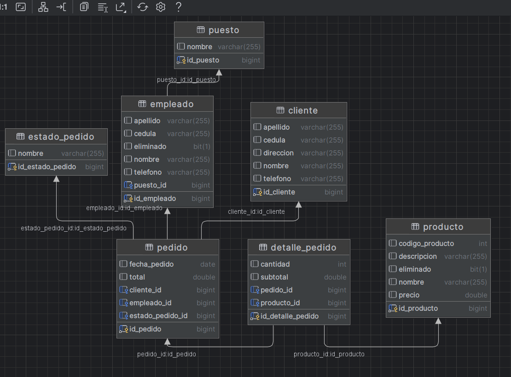
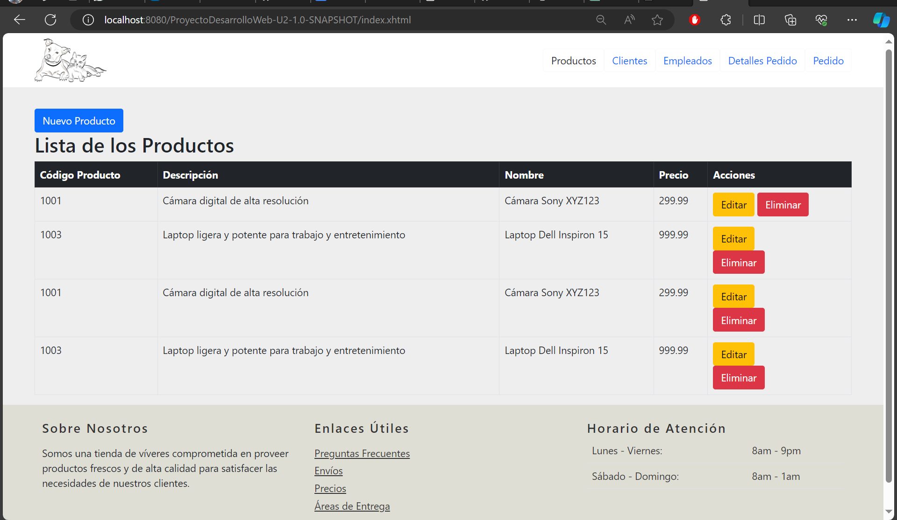
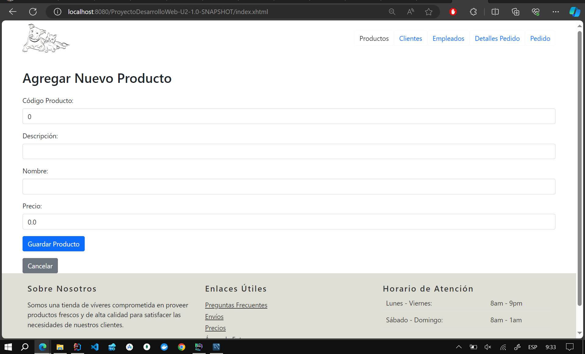
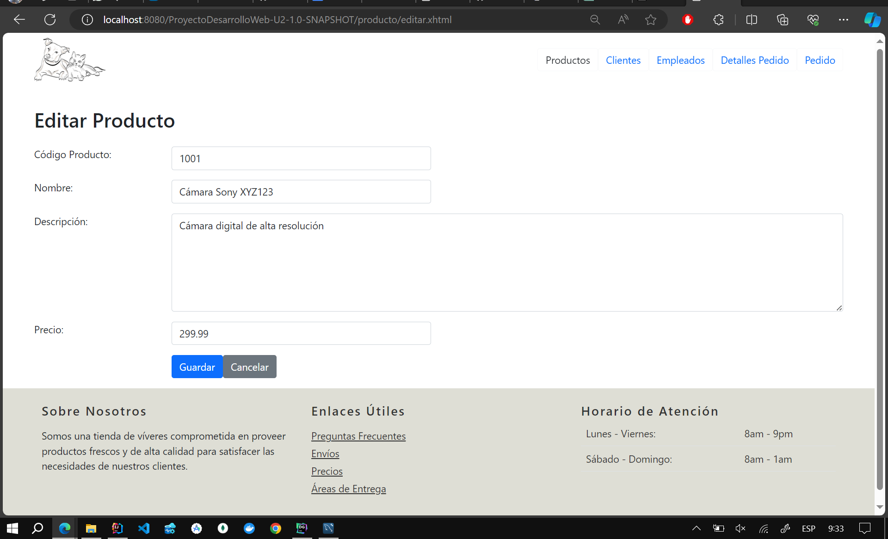

# Product Sales System - CRUD with JPA and JSF

This project implements a CRUD (Create, Read, Update, Delete) system using Java Persistence API (JPA) and JavaServer Faces (JSF) for managing products, customers, orders, order details, employees, and positions.

## Results
### ERD Diagram

### Product

### Soft Delete (Shows only records where deleted is false)

### New Product

### Edit Product

### Customers

### Employees

### Order

## Requirements

- JDK 8 or higher
- Apache Maven
- Application server compatible with JSF (e.g., Apache Tomcat)

## Project Setup

1. Clone the project repository from [https://github.com/Anyel-ec/JPA-JSF-ORM-StoreSalesSystem/tree/master](#).
2. Import the project into your favorite IDE as an existing Maven project.
3. Make sure you have set up an application server compatible with JSF in your development environment.

## Running the Project

1. Compile the project using Maven: `mvn clean install`.
2. Deploy the generated WAR file to your application server.

## Project Structure

The project is organized as follows:

- **src/main/java/com/espe/controller**: Contains controller classes to manage CRUD operations.
- **src/main/java/com/espe/dao**: Contains data access classes that implement the corresponding data access interface.
- **src/main/java/com/espe/idao**: Contains data access interfaces.
- **src/main/java/com/espe/model**: Contains data model classes.
- **src/main/webapp**: Contains JSF web pages and other static resources.

## Using the Project

The project offers the following functionalities:

- **Product Management**: Allows adding, editing, deleting, and listing products.
- **Customer Management**: Allows adding, editing, deleting, and listing customers.
- **Order Management**: Allows adding, editing, deleting, and listing orders, as well as assigning customers, employees, and order details to each order.
- **Order Detail Management**: Allows adding, editing, deleting, and listing order details, as well as assigning products and quantities to each order detail.
- **Employee Management**: Allows adding, editing, deleting, and listing employees, as well as assigning positions to each employee.

## Contributions

If you want to contribute to the project, you can send your pull requests through [https://github.com/Anyel-ec/JPA-JSF-ORM-StoreSalesSystem/tree/master](#).

## Contact Me
Click on the following link to directly message me on WhatsApp.
